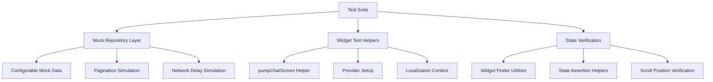
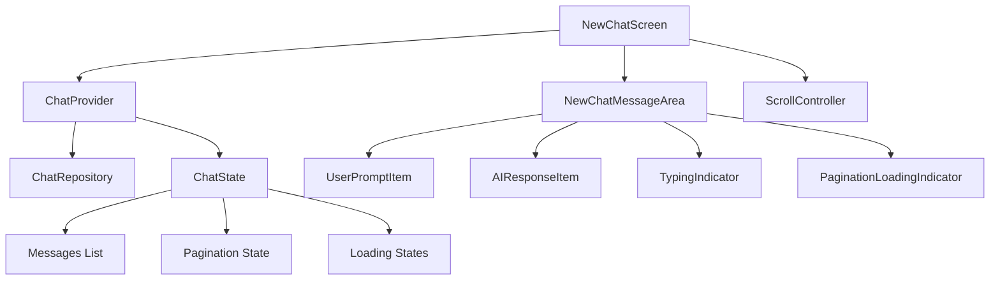

# Design Document

## Overview

This design document outlines a comprehensive test-driven refactoring approach to stabilize the ChatScreen component. The system will implement a robust testing framework that identifies and replicates all known bugs, followed by systematic refactoring to achieve complete stability. The design emphasizes test-first development, comprehensive coverage, and regression prevention.

## Architecture

### Testing Architecture



### Application Architecture Under Test



## Components and Interfaces

### 1. MockChatRepository

**Purpose**: Provide controlled, predictable data for testing scenarios

**Interface**:
```dart
class MockChatRepository implements ChatRepository {
  final Map<String, List<ChatMessage>> _conversationData;
  final Duration networkDelay;
  final bool shouldSimulateErrors;
  
  // Configure test data
  void setConversationData(String conversationId, List<ChatMessage> messages);
  void setNetworkDelay(Duration delay);
  void enableErrorSimulation(bool enabled);
  
  // Override repository methods
  @override
  Future<List<ChatMessage>> getMessages(String conversationId, {int page = 1, int limit = 20});
  
  @override
  Future<String> getMockResponse(String userInput, AiModel selectedModel);
}
```

**Key Features**:
- Configurable message data per conversation
- Simulated network delays for realistic testing
- Pagination boundary simulation (empty lists for end-of-history)
- Error injection capabilities for resilience testing

### 2. Test Helper Utilities

**Purpose**: Provide reusable test setup and verification utilities

**Interface**:
```dart
class ChatTestHelpers {
  // Setup helpers
  static Widget createTestApp(Widget child);
  static ProviderScope createProviderScope(List<Override> overrides);
  
  // Pump helpers
  static Future<void> pumpChatScreen(WidgetTester tester, {
    List<ChatMessage>? initialMessages,
    bool isLoading = false,
    MockChatRepository? mockRepository,
  });
  
  // Finder utilities
  static Finder findUserPromptItems();
  static Finder findAIResponseItems();
  static Finder findTypingIndicator();
  static Finder findPaginationLoader();
  
  // Verification helpers
  static void verifyUserPromptContent(WidgetTester tester, String expectedContent);
  static void verifyScrollPosition(ScrollController controller, double expectedOffset);
  static void verifyMessageOrder(List<ChatMessage> messages);
}
```

### 3. Test Data Generators

**Purpose**: Generate realistic test data for various scenarios

**Interface**:
```dart
class ChatTestData {
  // Generate test messages
  static List<ChatMessage> generateMessages(int count, {
    String conversationId = 'test_conv',
    DateTime? startTime,
  });
  
  // Generate paginated data
  static Map<int, List<ChatMessage>> generatePaginatedMessages(
    int totalMessages,
    int pageSize,
    String conversationId,
  );
  
  // Generate specific scenarios
  static List<ChatMessage> generateLongConversation(int messageCount);
  static List<ChatMessage> generateMixedConversation();
  static List<ChatMessage> generateEmptyConversation();
}
```

### 4. State Verification System

**Purpose**: Comprehensive state validation during tests

**Interface**:
```dart
class ChatStateVerifier {
  // Message integrity verification
  static void verifyMessageIntegrity(List<ChatMessage> messages);
  static void verifyUserPromptIntegrity(List<ChatMessage> userMessages);
  static void verifyAIResponseIntegrity(List<ChatMessage> aiMessages);
  
  // Pagination state verification
  static void verifyPaginationState(ChatState state, {
    required bool expectingInitialLoad,
    required bool expectingMoreMessages,
    required bool expectingEndOfHistory,
  });
  
  // Widget state verification
  static void verifyWidgetStates(WidgetTester tester);
  static void verifyScrollState(ScrollController controller);
}
```

## Data Models

### Enhanced Test Models

```dart
// Test-specific message model extensions
extension ChatMessageTestExtensions on ChatMessage {
  static ChatMessage createTestUser(String content, {String? id, DateTime? timestamp}) {
    return ChatMessage(
      id: id ?? 'test_user_${DateTime.now().millisecondsSinceEpoch}',
      content: content,
      isUserMessage: true,
      timestamp: timestamp ?? DateTime.now(),
    );
  }
  
  static ChatMessage createTestAI(String content, {String? id, DateTime? timestamp}) {
    return ChatMessage(
      id: id ?? 'test_ai_${DateTime.now().millisecondsSinceEpoch}',
      content: content,
      isUserMessage: false,
      timestamp: timestamp ?? DateTime.now(),
    );
  }
}

// Test scenario configurations
class TestScenario {
  final String name;
  final List<ChatMessage> messages;
  final Map<String, dynamic> configuration;
  final List<String> expectedBehaviors;
  
  const TestScenario({
    required this.name,
    required this.messages,
    required this.configuration,
    required this.expectedBehaviors,
  });
}
```

### Pagination Test Models

```dart
class PaginationTestConfig {
  final int totalMessages;
  final int pageSize;
  final Duration networkDelay;
  final bool simulateEndOfHistory;
  final bool simulateNetworkErrors;
  
  const PaginationTestConfig({
    this.totalMessages = 100,
    this.pageSize = 20,
    this.networkDelay = Duration(milliseconds: 100),
    this.simulateEndOfHistory = true,
    this.simulateNetworkErrors = false,
  });
}
```

## Error Handling

### Test Error Scenarios

1. **Network Failure During Pagination**
   - Simulate network timeouts
   - Test retry mechanisms
   - Verify graceful degradation

2. **State Corruption Detection**
   - Invalid message data
   - Null safety violations
   - Widget key conflicts

3. **Memory Pressure Scenarios**
   - Large message datasets
   - Rapid pagination requests
   - Resource cleanup verification

4. **Concurrent Operation Handling**
   - Multiple pagination requests
   - State updates during loading
   - Race condition prevention

### Error Recovery Strategies

```dart
class ErrorRecoveryStrategies {
  // State recovery
  static ChatState recoverFromCorruptedState(ChatState corruptedState);
  static List<ChatMessage> sanitizeMessageList(List<ChatMessage> messages);
  
  // UI recovery
  static void resetScrollPosition(ScrollController controller);
  static void clearLoadingStates(ChatState state);
  
  // Data recovery
  static Future<void> reloadConversationData(String conversationId);
  static void validateMessageIntegrity(List<ChatMessage> messages);
}
```

## Testing Strategy

### Test Categories

#### 1. Unit Tests
- **ChatProvider Logic**: State management and pagination logic
- **Repository Layer**: Data fetching and caching mechanisms
- **Model Validation**: Message integrity and state consistency
- **Utility Functions**: Helper methods and data transformations

#### 2. Widget Tests
- **Component Rendering**: Individual widget display and behavior
- **User Interactions**: Tap, scroll, and input handling
- **State Binding**: Provider integration and state updates
- **Animation Testing**: Loading indicators and transitions

#### 3. Integration Tests
- **End-to-End Flows**: Complete user scenarios from start to finish
- **Cross-Component Communication**: Provider interactions and data flow
- **Performance Testing**: Memory usage and rendering performance
- **Regression Testing**: Previously fixed bugs remain resolved

### Test Implementation Strategy

#### Phase 1: Bug Replication Tests
```dart
group('Bug Replication Tests', () {
  testWidgets('User prompt content corruption during pagination', (tester) async {
    // Arrange: Setup conversation with multiple pages
    // Act: Trigger pagination
    // Assert: Verify content integrity
  });
  
  testWidgets('Scroll position jumps during message loading', (tester) async {
    // Arrange: Position user in middle of conversation
    // Act: Load older messages
    // Assert: Verify scroll position stability
  });
  
  testWidgets('Typing indicator appears in wrong location', (tester) async {
    // Arrange: Setup active conversation
    // Act: Send message to trigger typing
    // Assert: Verify indicator position
  });
});
```

#### Phase 2: Comprehensive Functionality Tests
```dart
group('Comprehensive Functionality Tests', () {
  testWidgets('Initial load displays recent messages at bottom', (tester) async {
    // Test reverse list initial positioning
  });
  
  testWidgets('Pagination loads older messages at top', (tester) async {
    // Test reverse list pagination behavior
  });
  
  testWidgets('End of history stops loading attempts', (tester) async {
    // Test pagination termination
  });
});
```

#### Phase 3: State Management Tests
```dart
group('State Management Tests', () {
  testWidgets('Conversation switching preserves state', (tester) async {
    // Test conversation context preservation
  });
  
  testWidgets('Multiple loading states work correctly', (tester) async {
    // Test concurrent loading scenarios
  });
  
  testWidgets('Error states are handled gracefully', (tester) async {
    // Test error recovery mechanisms
  });
});
```

### Test Data Management

#### Mock Data Strategies
1. **Deterministic Generation**: Consistent test data across runs
2. **Scenario-Specific Data**: Tailored datasets for specific test cases
3. **Edge Case Coverage**: Empty lists, single messages, maximum limits
4. **Realistic Content**: Proper message formatting and timestamps

#### Test Environment Setup
1. **Isolated State**: Each test starts with clean state
2. **Controlled Dependencies**: Mock all external dependencies
3. **Predictable Timing**: Deterministic async operations
4. **Resource Cleanup**: Proper disposal of controllers and providers

## Performance Considerations

### Test Performance Optimization
- **Parallel Execution**: Independent tests run concurrently
- **Efficient Mocking**: Lightweight mock implementations
- **Selective Testing**: Focus on critical paths first
- **Fast Feedback**: Quick test execution for rapid iteration

### Application Performance Validation
- **Memory Usage Monitoring**: Track widget creation and disposal
- **Rendering Performance**: Measure frame rates during scrolling
- **State Update Efficiency**: Verify minimal unnecessary rebuilds
- **Resource Management**: Ensure proper cleanup of resources

## Implementation Phases

### Phase 1: Test Infrastructure (Foundation)
1. Create MockChatRepository with configurable behavior
2. Implement test helper utilities and setup functions
3. Create test data generators for various scenarios
4. Establish test environment with proper provider setup

### Phase 2: Bug Replication (Red Phase)
1. Write failing tests that replicate known bugs
2. Verify tests fail consistently and for the right reasons
3. Document expected vs actual behavior in test descriptions
4. Create comprehensive test coverage for all reported issues

### Phase 3: Systematic Refactoring (Green Phase)
1. Fix state management issues in ChatProvider
2. Resolve widget identity and lifecycle problems
3. Correct scroll position calculations for reverse lists
4. Implement proper error handling and recovery

### Phase 4: Regression Prevention (Refactor Phase)
1. Add additional edge case tests
2. Optimize performance while maintaining functionality
3. Enhance error handling and user feedback
4. Document all fixes and their corresponding tests

This design ensures a systematic, test-driven approach to stabilizing the chat system, with comprehensive coverage of all known issues and robust prevention of future regressions.